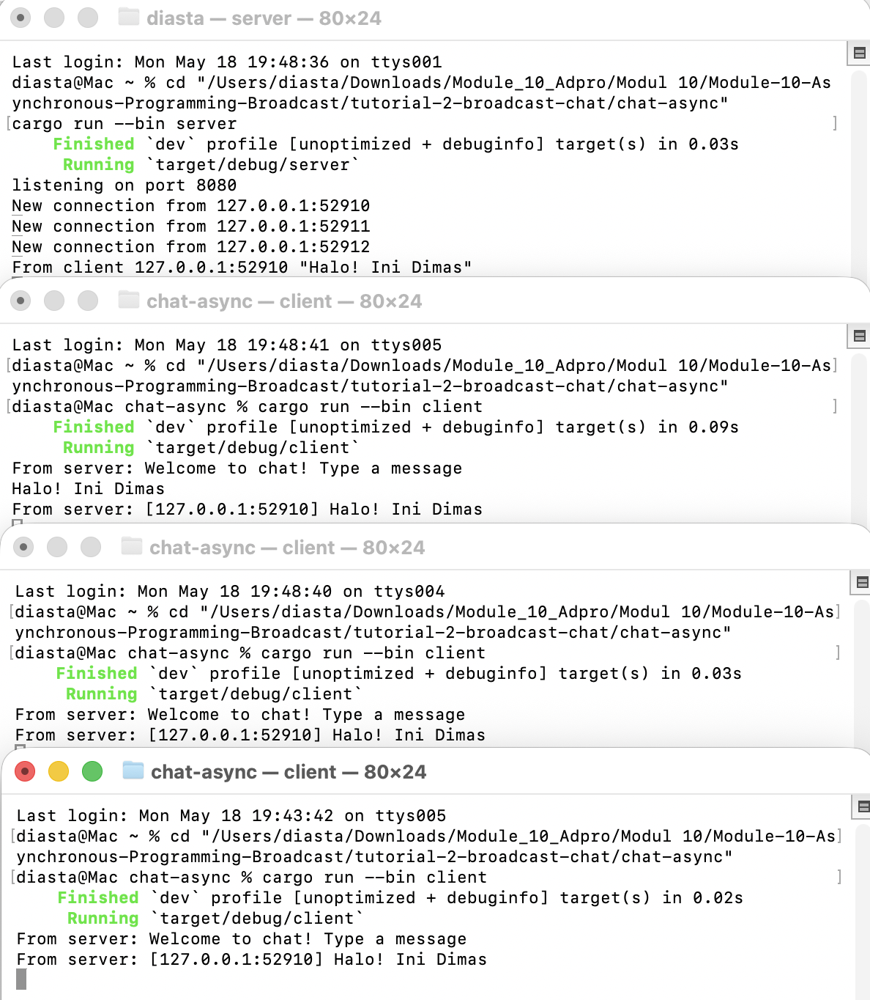
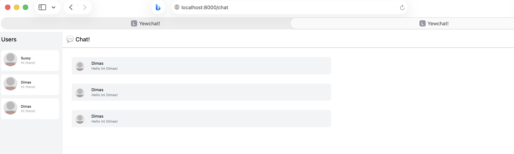
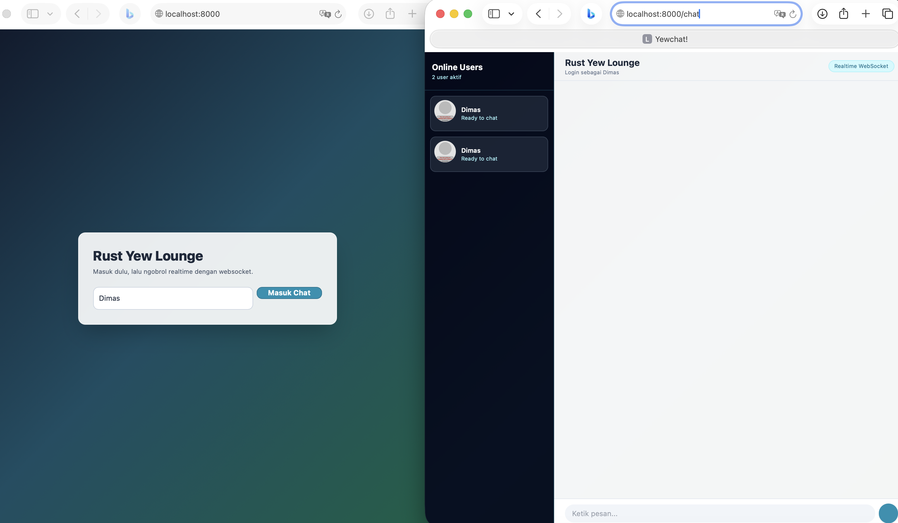

# Module 10 - Asynchronous Programming

<details>
<summary><strong>Tutorial 1: Timer</strong></summary>

### 1.1 Initial Code

Bagian ini memakai contoh resmi dari Async Book:
- https://rust-lang.github.io/async-book/02_execution/04_executor.html

Struktur kode:
- `tutorial-1-timer/timer_future`: implementasi `TimerFuture`
- `tutorial-1-timer/executor`: implementasi executor sederhana + spawner

Perubahan kecil yang saya lakukan hanya pada teks output agar sesuai signature pribadi:
- `Dimas Komputer: howdy!`
- `Dimas Komputer: done!`

Cara run:

```bash
cd tutorial-1-timer/executor
cargo run
```

Hasil run menunjukkan pesan awal, tunggu sekitar 2 detik, lalu pesan selesai.

### 1.2 Understanding how it works

Saya menambah satu `println!` tepat setelah `spawner.spawn(...)`:

```rust
println!("Dimas Komputer: task sudah di-spawn, executor belum jalan.");
```

Intinya:
- `spawner.spawn(...)` hanya memasukkan task ke queue.
- Task async belum dipoll waktu itu.
- Task baru benar-benar jalan saat `executor.run()` dipanggil.

Jadi urutan output jadi seperti ini:
1. `task sudah di-spawn, executor belum jalan.`
2. `howdy!`
3. tunggu 2 detik
4. `done!`

Screenshot hasil run saya taruh di folder `images/`:
- `images/experiment-1-2-run.png`


### 1.3 Multiple Spawn and removing drop

Pada bagian ini saya ubah `main` jadi:
- spawn 2 task (`Task A` dan `Task B`)
- bisa dijalankan 2 mode:
  - mode normal: `drop(spawner)` dipanggil
  - mode no-drop: `spawner` tidak di-drop (`--no-drop`)

Tujuannya untuk lihat efek:
- **spawner**: pengirim task baru ke executor.
- **executor**: loop yang poll task dari queue.
- **drop(spawner)**: menutup channel pengirim, jadi saat queue kosong `executor.run()` bisa selesai.

Kalau mode no-drop, program tidak exit walau task selesai, karena receiver masih menunggu kemungkinan task baru dari `spawner`.

Screenshot hasil run ada di:
- `images/experiment-1-3-normal.png`
- `images/experiment-1-3-no-drop.png`


</details>

<details>
<summary><strong>Tutorial 2: Broadcast Chat</strong></summary>

Referensi:
- https://google.github.io/comprehensive-rust/concurrency/async-exercises/chat-app.html

### 2.1 Original code of broadcast chat

Saya buat project chat async di:
- `tutorial-2-broadcast-chat/chat-async`

Project ini punya dua binary:
- `src/bin/server.rs`
- `src/bin/client.rs`

Cara jalankan:

```bash
cd tutorial-2-broadcast-chat/chat-async
cargo run --bin server
```

Lalu buka 3 terminal baru:

```bash
cd tutorial-2-broadcast-chat/chat-async
cargo run --bin client
```

Saat client kirim teks:
- server menerima message
- server broadcast ke semua client yang konek

Screenshot untuk 2.1 disimpan di:
- `images/experiment-2-1-three-clients.png`


### 2.2 Modifying the websocket port

Pada eksperimen ini saya ganti port websocket dari `2000` ke `8080`.

File yang diubah:
- `tutorial-2-broadcast-chat/chat-async/src/bin/server.rs`
  - `TcpListener::bind("127.0.0.1:8080")`
  - log jadi `listening on port 8080`
- `tutorial-2-broadcast-chat/chat-async/src/bin/client.rs`
  - URI koneksi jadi `ws://127.0.0.1:8080`

Kenapa dua sisi harus diubah:
- websocket itu koneksi client-server, jadi port harus sama di kedua sisi.
- kalau hanya server atau hanya client yang diubah, koneksi gagal.

Protokol yang dipakai tetap sama:
- masih `ws://` (WebSocket tanpa TLS).
- letak definisi protokol ada di URI client: `ws://127.0.0.1:8080`.

### 2.3 Small changes, add IP and Port

Perubahan kecil yang saya lakukan:
- format message broadcast di server sekarang ditambah info pengirim (`IP:Port`).

Lokasi perubahan:
- `tutorial-2-broadcast-chat/chat-async/src/bin/server.rs`

Sebelum:

```rust
bcast_tx.send(text.into())?;
```

Sesudah:

```rust
let tagged = format!("[{}] {}", addr, text);
bcast_tx.send(tagged)?;
```

Alasan ubah di server:
- server yang tahu alamat socket pengirim (`SocketAddr`),
- jadi paling tepat kalau tagging identitas pengirim dilakukan di server sebelum dibroadcast.

Screenshot hasil perubahan:
- `images/experiment-2-3-ip-port.png`


</details>

<details>
<summary><strong>Tutorial 3: WebChat using Yew</strong></summary>

Referensi:
- https://blog.devgenius.io/lets-build-a-websockets-project-with-rust-and-yew-0-19-60720367399f
- https://github.com/jtordgeman/YewChat
- https://github.com/jtordgeman/SimpleWebsocketServer

### 3.1 Original code

Saya clone dua project ke folder:
- `tutorial-3-webchat/YewChat`
- `tutorial-3-webchat/SimpleWebsocketServer`

Untuk kompatibilitas dengan toolchain Rust dan wasm sekarang, saya update lock dependency frontend/build tool supaya project tetap bisa dibuild.

Cara run server websocket:

```bash
cd tutorial-3-webchat/SimpleWebsocketServer
npm install
npm start
```

Cara run webclient Yew:

```bash
cd tutorial-3-webchat/YewChat
npm install
npm run start
```

Catatan:
- websocket client Yew terhubung ke `ws://127.0.0.1:8080`
- server `SimpleWebsocketServer` default listen di port `8080`

Screenshot 3.1:
- `images/experiment-3-1-original-code.png`


### 3.2 Be Creative!

Perubahan kreativitas yang saya buat fokus di webclient (`YewChat`):
- ganti tampilan login jadi card modern dengan gradient background.
- redesign halaman chat jadi layout lebih editorial:
  - sidebar user dengan status ringkas,
  - header chat dengan info user login,
  - bubble message beda warna untuk pesan sendiri dan pesan user lain.
- fallback avatar aman kalau data user belum sinkron (tidak panic).

File yang diubah:
- `tutorial-3-webchat/YewChat/src/components/login.rs`
- `tutorial-3-webchat/YewChat/src/components/chat.rs`

Screenshot 3.2:
- `images/experiment-3-2-be-creative.png`


</details>
