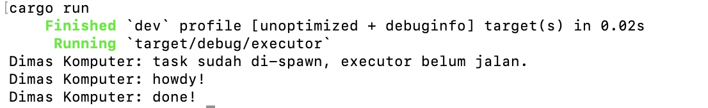
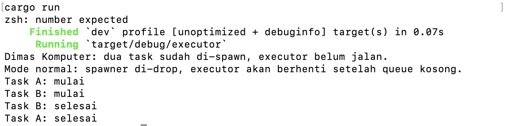
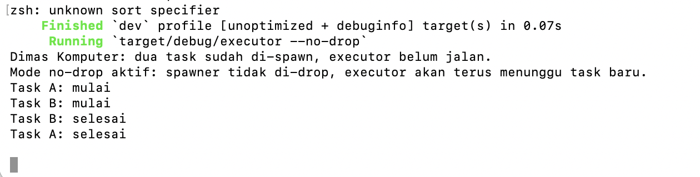
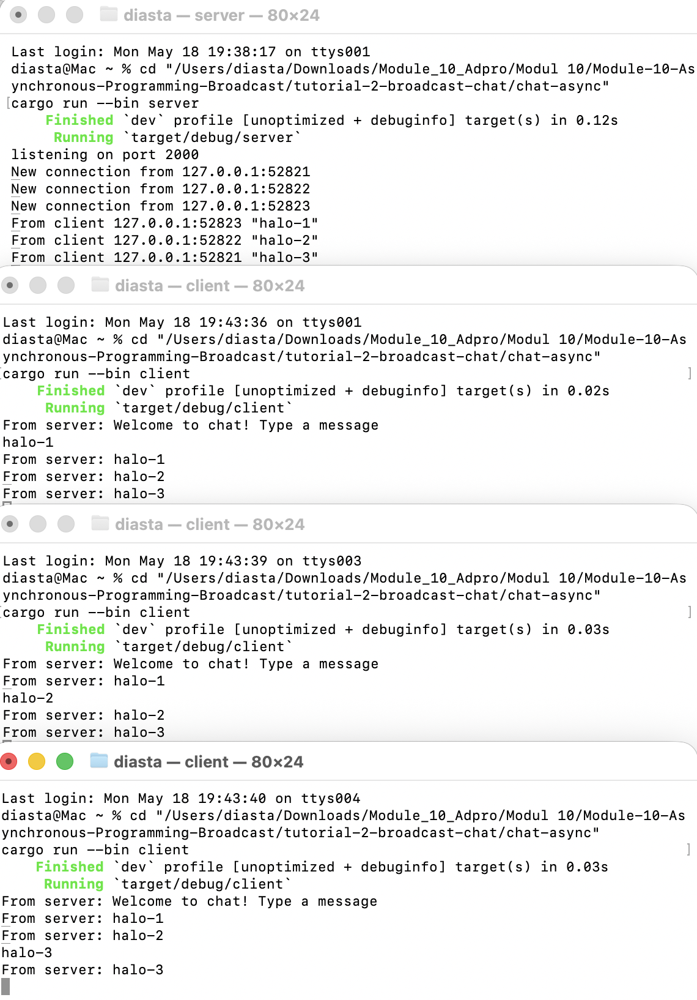

# Module 10 - Asynchronous Programming

## Tutorial 1: Timer

### 1.1 Initial Code

Bagian ini memakai contoh resmi dari Async Book:
- https://rust-lang.github.io/async-book/02_execution/04_executor.html

Struktur kode:
- `tutorial-1-timer/timer_future`: implementasi `TimerFuture`
- `tutorial-1-timer/executor`: implementasi executor sederhana + spawner

Perubahan kecil yang saya lakukan hanya pada teks output agar sesuai signature pribadi:
- `Dimas Komputer: howdy!`
- `Dimas Komputer: done!`

Cara run:

```bash
cd tutorial-1-timer/executor
cargo run
```

Hasil run menunjukkan pesan awal, tunggu sekitar 2 detik, lalu pesan selesai.

### 1.2 Understanding how it works

Saya menambah satu `println!` tepat setelah `spawner.spawn(...)`:

```rust
println!("Dimas Komputer: task sudah di-spawn, executor belum jalan.");
```

Intinya:
- `spawner.spawn(...)` hanya memasukkan task ke queue.
- Task async belum dipoll waktu itu.
- Task baru benar-benar jalan saat `executor.run()` dipanggil.

Jadi urutan output jadi seperti ini:
1. `task sudah di-spawn, executor belum jalan.`
2. `howdy!`
3. tunggu 2 detik
4. `done!`

Screenshot hasil run saya taruh di folder `images/`:
- `images/experiment-1-2-run.png`


### 1.3 Multiple Spawn and removing drop

Pada bagian ini saya ubah `main` jadi:
- spawn 2 task (`Task A` dan `Task B`)
- bisa dijalankan 2 mode:
  - mode normal: `drop(spawner)` dipanggil
  - mode no-drop: `spawner` tidak di-drop (`--no-drop`)

Tujuannya untuk lihat efek:
- **spawner**: pengirim task baru ke executor.
- **executor**: loop yang poll task dari queue.
- **drop(spawner)**: menutup channel pengirim, jadi saat queue kosong `executor.run()` bisa selesai.

Kalau mode no-drop, program tidak exit walau task selesai, karena receiver masih menunggu kemungkinan task baru dari `spawner`.

Screenshot hasil run ada di:
- `images/experiment-1-3-normal.png`
- `images/experiment-1-3-no-drop.png`



## Tutorial 2: Broadcast Chat

Referensi:
- https://google.github.io/comprehensive-rust/concurrency/async-exercises/chat-app.html

### 2.1 Original code of broadcast chat

Saya buat project chat async di:
- `tutorial-2-broadcast-chat/chat-async`

Project ini punya dua binary:
- `src/bin/server.rs`
- `src/bin/client.rs`

Cara jalankan:

```bash
cd tutorial-2-broadcast-chat/chat-async
cargo run --bin server
```

Lalu buka 3 terminal baru:

```bash
cd tutorial-2-broadcast-chat/chat-async
cargo run --bin client
```

Saat client kirim teks:
- server menerima message
- server broadcast ke semua client yang konek

Screenshot untuk 2.1 disimpan di:
- `images/experiment-2-1-three-clients.png`

